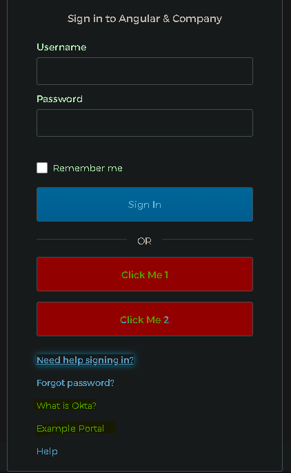
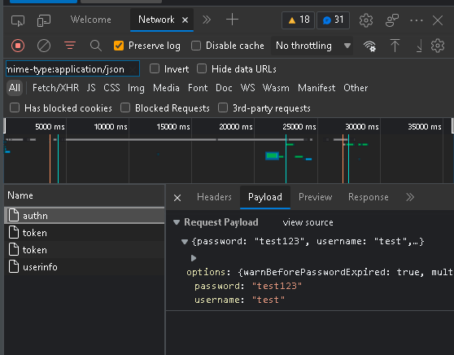

## Quick setup for Okta widget 
* this git [repo](https://github.com/ibrezm1/test-auth-angular-appigee)
* installation of okta cli is the fastest way for [setup](https://cli.okta.com/)
* installation more details [here](https://developer.okta.com/blog/2020/12/03/angular-okta)
* Remember default for 'start angular' has changed to okta hosted login ( redirect model considered to be more secure ) rather than widget 
```
# Prerequisite Install okta cli / npm / node  
>> okta start angular --branch widget
    Configuring a new OIDC Application, almost done:
    Created OIDC application, client-id: 0oa7q1li0abG6jJKm5d7
    Change the directory:
        cd angular
    Okta configuration written to: .okta.env
    Build this example using NPM:
        npm install
    And run with:
        npm start
>> cd angular
>> npm i 
>> npm start
```
* Okta credentials are stored in src/.okta.env
* modification of wiget can be done in src/app/login component [explained](https://developer.okta.com/docs/guides/custom-widget/main/#logo) custom links are visible only after clicking on need help


* Flow can be examined as below in chrome network -> mime-type:application/json -> Preserve Logs as below see more details for [sessionToken](https://developer.okta.com/docs/reference/api/authn/#authentication-operations)  ( api call to  {{url}}/api/v1/authn ) and [access_token](https://developer.okta.com/docs/reference/api/oidc/#authorize)  ( api call to {{url}}/api/v1/authorize)

* Excellent article to understand [PKCE flow](https://developer.okta.com/blog/2019/08/22/okta-authjs-pkce) and [10 mins](https://developer.okta.com/blog/2018/06/08/add-authentication-to-any-web-page-in-10-minutes)


