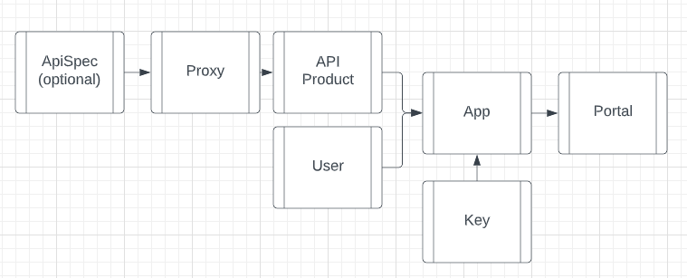

## Setup for Okta 
---
* installation of okta cli is the fastest way for [setup](https://cli.okta.com/)
* installation more details [here](https://developer.okta.com/blog/2020/12/03/angular-okta)
* Remember default for 'start angular' has changed to okta hosted login ( redirect model considered to be more secure ) rather than widget 
```
# Prerequisite Install okta cli / npm / node  
>> okta start angular --branch widget
    Configuring a new OIDC Application, almost done:
    Created OIDC application, client-id: 0oa7q1li0abG6jJKm5d7
    Change the directory:
        cd angular
    Okta configuration written to: .okta.env
    Build this example using NPM:
        npm install
    And run with:
        npm start
>> cd angular
>> npm i 
>> npm start
```
* Okta credentials are stored in src/.okta.env
* modification of wiget can be done in src/app/login component [explained](https://developer.okta.com/docs/guides/custom-widget/main/#logo) custom links are visible only after clicking on need help <br>


* Flow can be examined as below in chrome network -> mime-type:application/json -> Preserve Logs as below see more details for [sessionToken](https://developer.okta.com/docs/reference/api/authn/#authentication-operations)  ( api call to  {{url}}/api/v1/authn ) and [access_token](https://developer.okta.com/docs/reference/api/oidc/#authorize)  ( api call to {{url}}/api/v1/authorize) <br>
 
* Excellent article to understand [PKCE flow](https://developer.okta.com/blog/2019/08/22/okta-authjs-pkce) and [10 mins](https://developer.okta.com/blog/2018/06/08/add-authentication-to-any-web-page-in-10-minutes)
* without [libirary usage](https://developer.okta.com/blog/2017/04/17/angular-authentication-with-oidc) also check theck the examples on the page

## Spring boot Setup
* Excellent article on user authorisation using claims in [okta](https://developer.okta.com/blog/2019/06/20/spring-preauthorize) 
* Set up a resource server /messaes endpoint for our demo application [here](https://github.com/okta/samples-java-spring/tree/master/resource-server) 
* Ideally Angular should have HttpInterceptor for added security headers as showcased [here](https://developer.okta.com/blog/2018/08/22/basic-crud-angular-7-and-spring-boot-2)
```
private async handleAccess(request: HttpRequest<any>, next: HttpHandler): Promise<HttpEvent<any>> {
    // Only add to known domains since we don't want to send our tokens to just anyone.
    // Also, Giphy's API fails when the request includes a token.
    if (request.urlWithParams.indexOf('localhost') > -1) {
      const accessToken = await this.oktaAuth.getAccessToken();
      request = request.clone({
        setHeaders: {
          Authorization: 'Bearer ' + accessToken
        }
      });
    }
    return next.handle(request).toPromise();
  }
```

## APIGEE Setup
---
* Basic knowledge of API [edge](https://docs.apigee.com/api-platform/get-started/what-apigee-edge) and [tools](https://docs.apigee.com/api-platform/fundamentals/apigee-edge-command-line-tools)
* Creation of [open-api-Spec](https://docs.apigee.com/api-platform/tutorials/tutorial-create-spec)
* Creation of [simple-proxy](https://docs.apigee.com/api-platform/tutorials/create-api-proxy-openapi-spec)<br>

* Publish apigee api to [portal](https://docs.apigee.com/api-platform/publish/portal/publish-apis)
* Advanced Apigee [Examples](https://github.com/ra2085/apigee-scaffolding-samples)

## References 
---
* this git [repo](https://github.com/ibrezm1/test-auth-angular-appigee)
* Claims permisssions and scope in access token [here](https://auth0.com/docs/secure/tokens/access-tokens/validate-access-tokens)
* Udemy Angular + springboot + Okta [here](https://tcsglobal.udemy.com/course/full-stack-angular-spring-boot-tutorial/learn/lecture/13616930#overview) and [here](https://tcsglobal.udemy.com/course/enterprise-oauth-for-developers/learn/lecture/24845718#overview)
* Sample Apigee integration [here](https://toolkit.okta.com/apps/generator-okta-oidc-apigee/) and [here](https://www.youtube.com/watch?v=SrNy7P6Atf8) and [opa](https://www.styra.com/blog/api-authorization-apigee-okta-opa-part-1/) and [here](https://github.com/apigee/apigee-okta) and [here](https://github.com/StyraInc/opa-apigee-demo)

